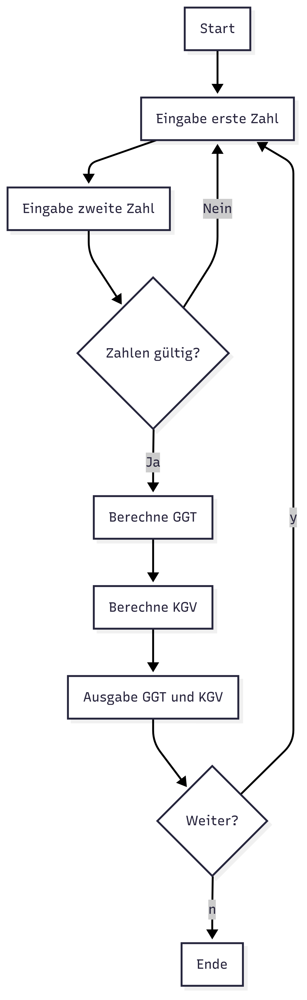

# Informatikaufgaben des 3. Schuljahres
Aufgaben sind in Packages unterteilt und enthalten, falls nötig, mehrere Klassen sowie eine Main-Klasse.

## Aufgaben
### [Aufgabe 1](src/Aufgabe1)
Teil dieser Aufgabe ist, den Grössten Gemeinsamen Teiler und das 
Kleinste Gemeinsame Vielfache zu berechnen. Es sollte wärend
dessen gwisse Prinzipien eingehalten werden. Obwohl diese
Aufgabe in Java umgesetzt werden sollte, muss kein OOP verwendet
werden über das hinaus was Java voraussetzt.

#### Exakte Aufgabestellung
Sie entwickeln ein einfaches MathTool. Dieses unterstützt folgende
Funktionalitäten.
- Benutzer gibt zwei ganze Zahlen ein.
- Programm gibt ggT und kgV aus.
- Nach Ausgabe der Frage "Weiter? [j/n]" startet eine neue Runde
  oder beendet das Programm.

1. Zeichnen Sie die nötigen/sinnvollen Diagramme.
2. Etwickeln Sie dieses Tool als Konsolen-Applikation in Java
   prozedural [nicht objektorientiert].
3. Kommentieren Sie im Source-Code die Eigenschaften des 
   Algorithmus, die Kriterien für Code-Qualität [ink. Kohäsion 
   und Kopplung]

#### Dateien
- [__Maindatei__](src/Aufgabe1/Main.java)

### [Aufgabe 2](src/Aufgabe2)
Ziel dieser Aufgabe ist es eine Parkhaus in Java zu programmieren.
Dies soll im OOP-style gemacht werden und entsprechende Prinzipien
beachtet werden.

#### Exakte Aufgabestellung
Sie entwickeln eine Parkhaus-Simulation. Diese unterstützt 
folgende Funktionalitäten:
- Die Einfahrtsschranke öffnet sich, wenn sie ein Ticket gezogen
  haben. Ein Ticket bekommen Sie nur, wenn noch freie Plätze
  verfügbar sind.
- Bezahlen Sie den Parkpreiss [Minutenpreiss] bei einer der auf
  den Stockwerken befindlichen Kassen.
- Fahren Sie bei einer der zwei Ausfahrtsschranken aus. Die 
  Schranke öffnet sich nur, wenn das Ticket bezahlt wurde.
- Zeigen Sie auf dem Display von  dem Parkhaus an, wie viele
  Plätze noch frei sind.

1. Zeichnen Sie die nötigen/sinnvollen UML-Diagramme.
2. Entwickeln Sie diese Simulation als Konsolen-Applikation in 
   Java in einem git-Repository.
3. Kommentieren Sie im Source-Code die Konstrukte der OOP und das
   Solid-Prinzip.

#### Dateien
- [__Maindatei__](src/Aufgabe2/Main.java)
- [Fahrer](src/Aufgabe2/Fahrer.java)
- [Auto](src/Aufgabe2/Auto.java)
- [Ticket](src/Aufgabe2/Ticket.java)
- [Ticketautomat](src/Aufgabe2/TicketAutomat.java)
  - [Kassenautomat](src/Aufgabe2/KassenAutomat.java)
  - [Schrankenautomat](src/Aufgabe2/SchrankenAutomat.java)
- [Schranke](src/Aufgabe2/Schranke.java)
- [Parkplatz](src/Aufgabe2/Parkhaus.java)
- [Etage](src/Aufgabe2/Etage.java)
- [Parkhaus](src/Aufgabe2/Parkhaus.java)
